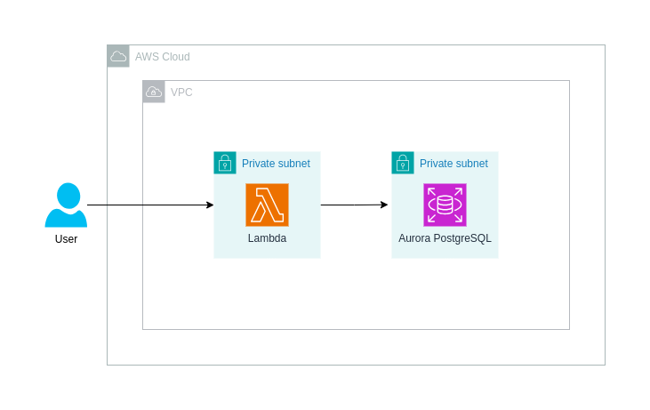

# Lambda and RDS Aurora Integration
Provision a fully ready integration for Lambda function to communicate with RDS Aurora.

For this POC I've used PostgreSQL engine.

### Requirements
- Terraform
- AWS Account

### Set Up
1. `cd ./infra`
2. `terraform plan && terraform apply`
3. Call the lambda function
```bash
aws lambda invoke --function-name IntegrationFunction response.json
```
4. Check the results using `cat response.json`. You will see:
```json
{
  "statusCode": 200,
  "body": "{\"posgres_version\": \"PostgreSQL 15.4 on x86_64-pc-linux-gnu, compiled by x86_64-pc-linux-gnu-gcc (GCC) 9.5.0, 64-bit\"}"
}
```
5. Clean resources with `terraform destroy`

### Architecture

